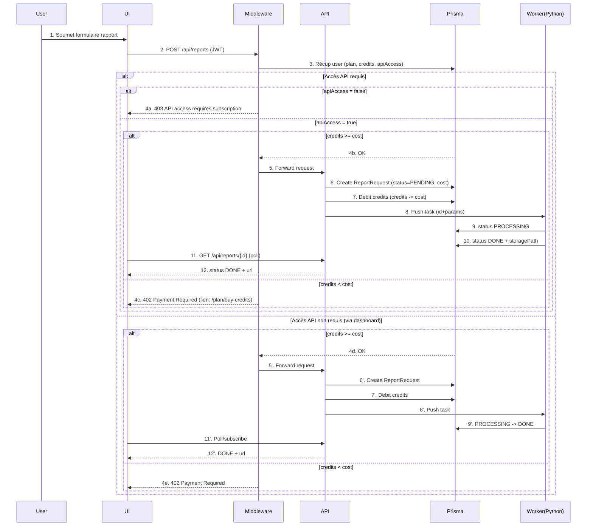

agent.md

0) Identité & cible
	•	Nom: FinAnalytics (.site pour l’instant, .com trop cher)
	•	Pitch (1 phrase): Plateforme d’analyse boursière automatisée qui génère des rapports personnalisés sur ETF, indices et marchés.
	•	Cibles initiales: investisseurs particuliers “du dimanche” + petits traders (analyses simples au départ).
	•	Valeur: gain de temps d’analyse du marché + nombreux graphiques pour une vue d’ensemble (lecture rapide du rapport quotidien le matin).

1) Offre produit
	•	Types d’analyse:
	•	Baseline (rapport simple)
	•	Options: Pricer (custom ou générique), Deep analysis, Benchmarks/comparaisons (si le but est de comparer explicitement)
	•	Canaux d’accès:
	•	Dashboard web (Next.js 15, Tailwind 4, shadcn/ui)
	•	API (réservée aux abonnés)

2) Données & pipeline
	•	Ingestion: CRON/script Python (ou API externes) → dump dans un dossier ou stockage dédié
	•	Webapp: découplée de la partie Python
	•	DB: Postgres via Prisma
	•	Évolutions prévues: ajout de news relatives (non prioritaire pour le MVP)

3) Monétisation (modèle hybride)
	•	Abonnement (préféré): revenus récurrents, stable, lissé, inclut des crédits réinitialisés mensuellement + API réservée aux abonnés + SAV VIP selon plan.
	•	Crédits supplémentaires: achat ponctuel pour compléter l’abonnement si besoin (légère réduction de l’écart tarifaire vs abo, mais l’abonnement reste significativement plus rentable).

3.1 Plans d’abonnement (API incluse)

L’abonnement est plus rentable que l’achat direct de crédits. Les crédits inclus se rechargent chaque mois.

	•	Starter — 29€/mois
	•	100 crédits/mois (~5 rapports standards)
	•	Charts & export PDF
	•	Mises à jour mensuelles
	•	SAV Standard
	•	Équiv. valeur crédit: ~69€ → ~58% d’économie vs achat direct
	•	Professional — 99€/mois (le plus populaire)
	•	500 crédits/mois (~25 rapports standards ou usage API)
	•	CSV & API (exclusive abonnés)
	•	Alertes hebdo, Benchmarks avancés
	•	SAV Prioritaire
	•	Équiv. valeur crédit: ~299€ → ~67% d’économie
	•	Enterprise — 299€/mois
	•	2000 crédits/mois
	•	SSO, SLA, auditing, Team workspaces
	•	API + SAV VIP 24/7
	•	Équiv. valeur crédit: ~1 099€ → ~73% d’économie

Rappel: l’API n’est pas disponible avec les packs de crédits seuls (elle est réservée aux abonnés).

3.2 Packs de crédits (ponctuels, sans API)
	•	100 crédits — 69€ (valables 12 mois)
	•	Rapport standard = 20 crédits
	•	Benchmark module = +12
	•	API export = +5 (non disponible sans abo, laisse visible mais grisé)
	•	500 crédits — 299€ (12 mois) — Best value ponctuel
	•	Prix/credit inférieur au pack 100
	•	Traitement prioritaire
	•	Exports PDF/CSV illimités
	•	Pas d’API
	•	2000 crédits — 1 099€ (12 mois)
	•	Pour gros volumes occasionnels
	•	Alertes illimitées
	•	SAV prioritaire
	•	Pas d’API

4) Accès API (abonnés uniquement)
	•	Condition: user apiAccess = true (lié au plan actif)
	•	Quota: débit sur le stock de crédits mensuels (et/ou sur crédits supplémentaires)
	•	Refus: si credits < coût, réponse 402 Payment Required
	•	Sécurité: JWT (Better Auth), rate limiting, logs d’usage

5) Authentification
	•	Providers: Google, GitHub (remplaçable plus tard par Microsoft/Apple) + Email/Password
	•	2FA: à activer dans une version ultérieure (TOTP)

6) Stack & infra
	•	Frontend: Next.js 15, Tailwind 4, shadcn/ui, Zod
	•	Backend: Next.js API routes (ou /app route handlers)
	•	Auth: Better Auth
	•	DB: Postgres + Prisma
	•	Jobs: Workers Python (CRON/queue)
	•	Paiements: Polar (abonnements + one-off), webhooks pour créditer
	•	Infra:
	•	Proposition (à valider plus tard):
	•	Vercel (Front + API)
	•	Supabase / Neon / RDS pour Postgres
	•	Storage: S3 compatible (Backblaze/Cloudflare R2) pour rapports
	•	Queue: Upstash Redis / Cloud Tasks / Celery + Redis
	•	Observabilité: Sentry + OpenTelemetry

7) Arborescence UI (Next.js)
	•	/dashboard — solde crédits, plan actif, derniers rapports, CTA Générer/Buy Credits
	•	/reports
	•	/reports/history — table, filtres (ETF/Indice/Marché, options), (re)générer, télécharger
	•	/reports/generate — wizard (type d’actif → actif → options → récurrence → coût → confirmer)
	•	/reports/recurring — liste, créer/pauser/modifier
	•	/plan
	•	/plan/current — plan + crédits restants + renouvellement
	•	/plan/buy-credits — packs sans API
	•	/plan/upgrade — comparaison plans + mise à niveau
	•	/plan/billing — factures
	•	/settings — profil, providers, mots de passe, notifications, (plus tard 2FA)

8) Workflows (Mermaid)

8.1 Workflow complet (mis à jour quotas/crédits)



8.2 Workflow abonnements & crédits (Polar + Webhooks)
```mermaid
flowchart LR
    A[User authenticated (Better Auth)] --> B{Choix: Abonnement ou Crédits}
    B -->|Abonnement| C[Créer checkout Polar]
    C --> D[Payment success]
    D --> E[Webhook subscription.created/renewed]
    E --> F[API /api/webhooks/polar]
    F -->|Prisma| G[Update user: plan, apiAccess=true, credits += planCredits, renewalDate]

    B -->|Crédits| C2[Créer checkout Polar (one-off)]
    C2 --> D2[Payment success]
    D2 --> E2[Webhook order.completed]
    E2 --> F2[/api/webhooks/polar]
    F2 -->|Prisma| G2[Update user: credits += packCredits (pas d’API)]
```
8.3 Workflow récurrence des rapports
```mermaid
flowchart TD
    S[Créer automatisation] --> A[Choix actifs + options]
    A --> B[Fréquence (quotidienne/hebdo/mensuelle) + heure]
    B --> C[Calcul coût/occurrence + estimation mensuelle]
    C --> D[Save schedule (Prisma)]
    D --> E[Job Runner/CRON]
    E --> F{Credits >= coût?}
    F -->|Non| G[Notifier + proposer achat crédits]
    F -->|Oui| H[Débiter crédits]
    H --> I[Worker Python génère rapport]
    I --> J[Stockage + status DONE]
    J --> K[Email/Notif + /reports/history]
```
9) Points UX/UI clés
	•	Afficher coût en crédits en temps réel dans /reports/generate
	•	Banner “API exclusive abonnés” sur packs crédits
	•	Sur /dashboard: barre de progression crédits + CTA “Acheter crédits”/“Passer Pro”
	•	Sur /plan/upgrade: comparateur avec mise en avant des économies vs packs

10) Intégration paiements (Polar)
	•	Oui, Polar convient bien (abos + one-off, webhooks fiables).
	•	Lier userId Better Auth ↔ client Polar (métadonnée).
	•	Webhooks traitent: subscription.created, subscription.renewed, order.completed.
	•	Chaque event → mise à jour Prisma (plan/credits/apiAccess).

11) Sécurité & conformité
	•	JWT (Better Auth), apiAccess gate, rate limiting, audit logs API
	•	Stockage rapports en lecture privée + URL signées
	•	2FA plus tard (TOTP), mot de passe haché (argon2/bcrypt)
	•	Logs & alerting (Sentry)

12) Roadmap (MVP → plus)
	•	MVP: Ingestion basique + rapports simples + pricer générique + abonnements + packs + API abonnés + récurrence.
	•	Next: deep analysis, pricer custom, benchmarks étendus, actus, 2FA, Microsoft/Apple OAuth, affi marketing (Instagram), programme d’affiliation.
	•	Scale: multi-market coverage, IA pour insights, modèles tarif dynamiques.

⸻

Annexes (snippets types)

Middleware API (gate + débit crédits)

// /app/api/secure/route.ts
import { getUser } from "@/lib/auth"
import { prisma } from "@/lib/prisma"

export async function POST(req: Request) {
  const user = await getUser()
  if (!user) return new Response("Unauthorized", { status: 401 })

  const requiredCredits = 20 // calculé selon options
  if (!user.apiAccess) return new Response("API access requires subscription", { status: 403 })

  const dbUser = await prisma.user.findUnique({ where: { id: user.id } })
  if (!dbUser || dbUser.credits < requiredCredits) {
    return new Response("Payment Required", { status: 402 })
  }

  await prisma.user.update({
    where: { id: user.id },
    data: { credits: { decrement: requiredCredits } },
  })

  // ... traiter la demande
  return new Response(JSON.stringify({ ok: true }))
}

Webhook Polar (schéma)

// /app/api/webhooks/polar/route.ts
import { prisma } from "@/lib/prisma"
import { NextRequest } from "next/server"

export async function POST(req: NextRequest) {
  const raw = await req.text()
  const sig = req.headers.get("polar-signature") || ""
  // verifySignature(raw, sig) ...

  const event = JSON.parse(raw)

  switch (event.type) {
    case "subscription.created":
    case "subscription.renewed":
      await prisma.user.update({
        where: { id: event.data.userId },
        data: {
          subscriptionPlan: event.data.planName,
          apiAccess: true,
          credits: { increment: event.data.planCredits },
          subscriptionRenewal: new Date(event.data.nextBillingDate),
        },
      })
      break
    case "order.completed":
      await prisma.user.update({
        where: { id: event.data.userId },
        data: { credits: { increment: event.data.packCredits } },
      })
      break
  }

  return new Response("ok")
}
