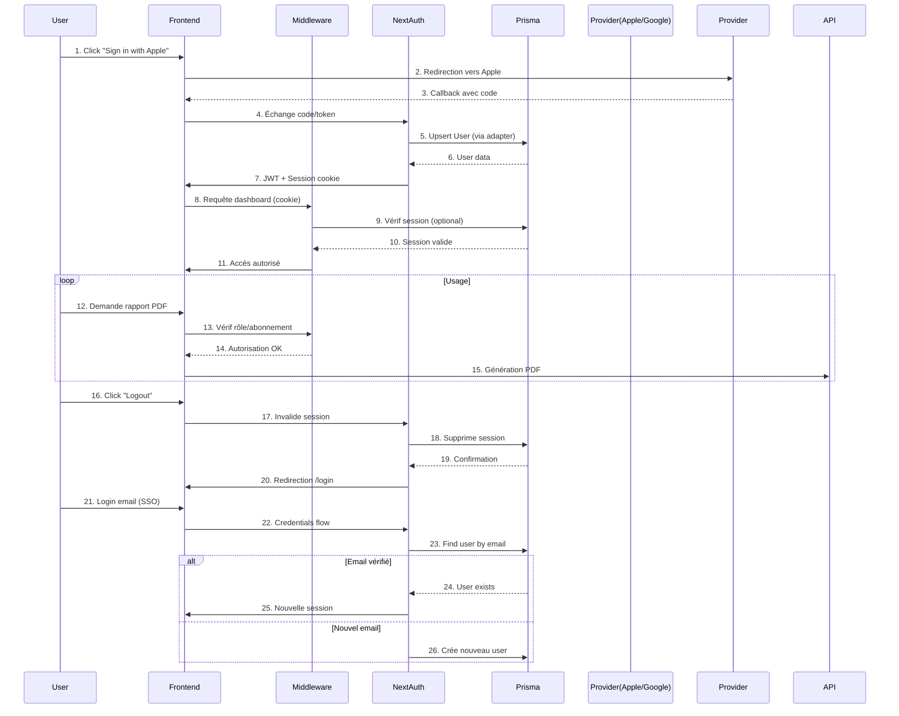
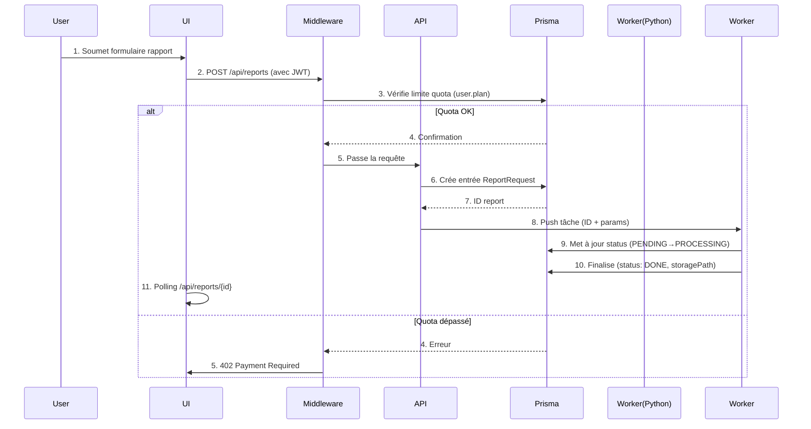

# AGENTS.MD - Documentation Technique HedgeFound

## 1. Architecture Globale
### Structure des Dossiers
```
app/
├── (app)/          # Zone authentifiée (dashboard)
│   ├── api/        # Routes API internes
│   └── dashboard/  # Pages du dashboard
└── (home)/         # Zone publique (landing/auth)
src/
├── components/     # Composants organisés par fonction
├── lib/            # Utilitaires (auth, prisma)
└── hooks/          # Hooks personnalisés
```

### Services Externes
- **Auth Providers** : Google, Apple (via NextAuth)
- **Futurs Intégrations** : Stripe (paiements), Cron jobs (scripts Python)

## 2. Authentification
### Flow d'Authentification
- **Deux méthodes** :
  1. Page dédiée (`/signin`) sans layout
  2. Modal via sidebar (dans l'espace dashboard)
- **Gestion des Sessions** : JWT avec NextAuth
- **Problème Connu** : Conflit de redirection après logout (à investiguer)

### Modèle Utilisateur (Prisma)
```prisma
// Extensions possibles (à confirmer) :
model User {
  id            String    @id @default(cuid())
  name          String?
  email         String?   @unique
  emailVerified DateTime?
  image         String?
  accounts      Account[]
  sessions      Session[]
  pdfs          Pdf[]     // Relation future aux PDF générés
}
```

## 3. Dashboard
### Composants Clés (shadcn)
- **Structure** :
  - `sidebar.tsx` (navigation principale)
  - `data-table` (liste des PDF)
  - `card` (stats résumées)
- **Thème** : Light/Dark mode implémenté via `ThemeProvider`
- **Squelettes** : Loading states (`dashboardSkeleton.tsx`)

## 4. Fonctionnalités Futures
### Priorités
1. **Correction Auth** : 
   - Résolution du bug de redirection post-logout
   - Gestion propre des sessions multiples
2. **Gestion des PDF** :
   - Intégration des scripts Python (cron)
   - Stockage des résultats (S3 ou dossier local)
3. **Monétisation** :
   - Intégration Stripe (abonnements)
   - Limitation des fonctionnalités par plan

## 5. Sécurité
### Mesures Actives
- **Authentification** : 
  - NextAuth avec chiffrement JWT
  - Protection des routes via middleware
- **Fichiers** : 
  - Accès restreint aux PDF utilisateur

### À Prévoir
- Audit de sécurité après intégration Stripe
- Politique de backup des données (Prisma)

## 6. Roadmap
### Court Terme (1-2 semaines)
- [x] Intégration Google/Apple Auth
- [ ] Correction flow de logout
- [ ] Page Settings (profil, préférences)

### Moyen Terme
- [ ] Système de génération PDF
- [ ] Intégration Stripe
- [ ] Dashboard admin (suivi utilisateurs)

## Schéma Global : Cycle de Connexion/Déconnexion


## Schéma Séquence Rapport PDF

