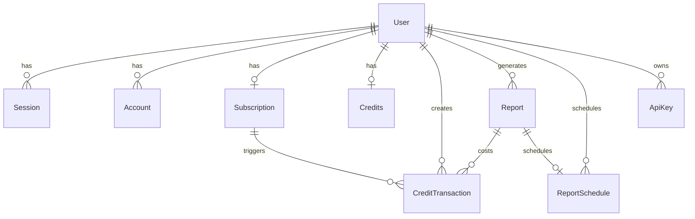

# 🗄️ FinAnalytics - Database Architecture

## 📋 Table des Matières
- [Vue d'ensemble](#vue-densemble)
- [Schéma des relations](#schéma-des-relations)
- [Tables principales](#tables-principales)
- [Relations détaillées](#relations-détaillées)
- [Index et performances](#index-et-performances)

---

## 🏗️ Vue d'ensemble

**Base de données** : PostgreSQL 14+  
**ORM** : Prisma  
**Migrations** : Automatiques via Prisma  
**Backup** : Snapshots quotidiens  

### Architecture Multi-Domaines
```
┌─────────────────┐  ┌─────────────────┐  ┌─────────────────┐
│   AUTHENTIFICATION   │  │    BUSINESS     │  │      SYSTÈME      │
├─────────────────┤  ├─────────────────┤  ├─────────────────┤
│ • User          │  │ • Report        │  │ • ApiRequest    │
│ • Session       │  │ • Credits       │  │ • ApiKey        │
│ • Account       │  │ • Subscription  │  │ • Verification  │
│ • Verification  │  │ • Transaction   │  │                 │
└─────────────────┘  └─────────────────┘  └─────────────────┘
```

---

## 🔗 Schéma des Relations

### Diagramme ERD Simplifié


---

## 📊 Tables Principales

### 👤 **User** - Utilisateurs
```sql
user {
  id            String   PK
  name          String
  email         String   UNIQUE
  emailVerified Boolean
  image         String?
  role          UserRole DEFAULT(USER)
  createdAt     DateTime
  updatedAt     DateTime
}
```
**Relations** :
- `1:N` → Session (sessions utilisateur)
- `1:N` → Account (comptes OAuth liés)
- `1:1` → Subscription (abonnement actuel)
- `1:1` → Credits (solde de crédits)
- `1:N` → Report (rapports générés)
- `1:N` → ApiKey (clés API personnelles)

---

### 🔐 **Session** - Sessions d'authentification
```sql
session {
  id        String   PK
  expiresAt DateTime
  token     String   UNIQUE
  createdAt DateTime
  updatedAt DateTime
  ipAddress String?
  userAgent String?
  userId    String   FK → user.id
}
```
**Logique** :
- Durée de vie : 30 jours
- Rotation automatique des tokens
- Tracking IP/UserAgent pour sécurité

---

### 💳 **Subscription** - Abonnements
```sql
subscription {
  id                   String           PK
  userId               String           UNIQUE FK → user.id
  plan                 SubscriptionPlan DEFAULT(FREE)
  billingCycle         BillingCycle     DEFAULT(MONTHLY)
  apiAccess            Boolean          DEFAULT(false)
  isActive             Boolean          DEFAULT(true)
  startedAt            DateTime         DEFAULT(now())
  renewsAt             DateTime?
  cancelledAt          DateTime?
  polarSubscriptionId  String?
  polarCustomerId      String?
  polarProductId       String?
}
```
**Plans disponibles** :
- `FREE` : 0€, 50 crédits/mois, pas d'API
- `STARTER` : 29€, 100 crédits/mois, API
- `PROFESSIONAL` : 99€, 500 crédits/mois, API
- `ENTERPRISE` : 299€, 2000 crédits/mois, API

---

### 🪙 **Credits** - Gestion des crédits
```sql
credits {
  id             String   PK
  userId         String   UNIQUE FK → user.id
  balance        Int      DEFAULT(0)
  monthlyCredits Int      DEFAULT(0)
  lastRecharge   DateTime?
}
```
**Logique de recharge** :
```javascript
// Recharge automatique mensuelle pour abonnés
if (subscription.isActive && shouldRecharge) {
  credits.balance += credits.monthlyCredits;
  credits.lastRecharge = now();
}
```

---

### 💰 **CreditTransaction** - Historique des transactions
```sql
credit_transaction {
  id           String          PK
  userId       String          FK → user.id
  type         TransactionType
  amount       Int             // Positif: achat, Négatif: usage
  description  String
  balanceAfter Int
  reportId     String?         FK → report.id
  externalId   String?         // ID Polar/Stripe
  metadata     Json?
  createdAt    DateTime
}
```
**Types de transactions** :
- `SUBSCRIPTION_RECHARGE` : Recharge mensuelle auto
- `PACK_PURCHASE` : Achat pack crédits one-time
- `REPORT_USAGE` : Débit pour génération rapport
- `REFUND` : Remboursement
- `BONUS` : Bonus admin
- `EXPIRY` : Expiration crédits

---

### 📄 **Report** - Rapports générés
```sql
report {
  id                   String      PK
  userId               String      FK → user.id
  title                String
  assetType            AssetType
  assetSymbol          String
  reportType           ReportType  DEFAULT(BASELINE)
  includeBenchmark     Boolean     DEFAULT(false)
  includeApiExport     Boolean     DEFAULT(false)
  creditsCost          Int
  status               ReportStatus DEFAULT(PENDING)
  pdfPath              String?
  csvPath              String?
  processingStartedAt  DateTime?
  completedAt          DateTime?
  failureReason        String?
  createdAt            DateTime
  updatedAt            DateTime
}
```

**Workflow des statuts** :
```
PENDING → PROCESSING → COMPLETED
                    ↘  FAILED
                    ↘  CANCELLED
```

**Types d'actifs** :
- `STOCK` : Actions individuelles
- `ETF` : Fonds négociés en bourse
- `INDEX` : Indices de marché
- `MARKET` : Marchés globaux

**Types de rapports** :
- `BASELINE` : Analyse standard (20 crédits)
- `DEEP_ANALYSIS` : Analyse approfondie (40 crédits)
- `PRICER` : Valorisation custom (60 crédits)
- `BENCHMARK` : Comparaisons sectorielles (30 crédits)

---

### 🔄 **ReportSchedule** - Rapports programmés
```sql
report_schedule {
  id                   String            PK
  userId               String            FK → user.id
  reportId             String            UNIQUE FK → report.id
  frequency            ScheduleFrequency
  hour                 Int               DEFAULT(9)
  dayOfWeek            Int?              // 1=Lundi, 7=Dimanche
  dayOfMonth           Int?              // 1-31
  isActive             Boolean           DEFAULT(true)
  nextRunAt            DateTime
  lastRunAt            DateTime?
  estimatedMonthlyCost Int
}
```

---

### 🔑 **ApiKey** - Clés d'API utilisateur
```sql
api_key {
  id         String   PK
  userId     String   FK → user.id
  name       String   // Nom donné par l'utilisateur
  keyHash    String   UNIQUE // Hash SHA-256
  keyPrefix  String   // "fa_live_abc..." visible
  isActive   Boolean  DEFAULT(true)
  rateLimit  Int      DEFAULT(100) // req/heure
  lastUsedAt DateTime?
  usageCount Int      DEFAULT(0)
  createdAt  DateTime
  updatedAt  DateTime
  expiresAt  DateTime?
}
```

**Format des clés** :
- Production : `fa_live_...`
- Test : `fa_test_...`
- Longueur : 32 caractères aléatoines

---

### 📡 **ApiRequest** - Logs des requêtes API
```sql
api_request {
  id           String           PK
  userId       String
  endpoint     String
  method       String
  ipAddress    String?
  userAgent    String?
  apiKeyId     String?
  status       ApiRequestStatus
  responseTime Int?             // millisecondes
  creditsUsed  Int              DEFAULT(0)
  requestSize  Int?             // bytes
  responseSize Int?             // bytes
  errorMessage String?
  createdAt    DateTime
}
```

---

## 🚀 Index et Performances

### Index Principaux
```sql
-- Authentification rapide
CREATE INDEX idx_session_token ON session(token);
CREATE INDEX idx_user_email ON user(email);

-- Requêtes fréquentes rapports
CREATE INDEX idx_report_user_status ON report(userId, status);
CREATE INDEX idx_report_created_at ON report(createdAt DESC);

-- API monitoring
CREATE INDEX idx_api_request_user_date ON api_request(userId, createdAt);
CREATE INDEX idx_api_key_hash ON api_key(keyHash);

-- Transactions et facturation
CREATE INDEX idx_credit_transaction_user_date ON credit_transaction(userId, createdAt);
```

### Optimisations
- **Partitioning** : `api_request` par mois
- **Archivage** : Sessions expirées > 90 jours
- **Vacuum** : Automatique quotidien
- **Réplication** : Read replicas pour analytics

---

## 🔒 Sécurité

### Chiffrement
- **Passwords** : bcrypt avec salt
- **API Keys** : SHA-256 hash stocké
- **PII** : Chiffrement au niveau application

### Audit
- Tous les changements d'état trackés
- Logs d'accès conservés 1 an
- Conformité GDPR (anonymisation/suppression)

### Backup & Recovery
- **Snapshots** : Quotidiens avec 30j rétention
- **PITR** : Point-in-time recovery 7 jours
- **Geo-backup** : Réplication cross-région

---

## 📈 Monitoring & Métriques

### Métriques Business
```sql
-- Utilisateurs actifs quotidiens
SELECT COUNT(DISTINCT userId) FROM api_request 
WHERE createdAt >= CURRENT_DATE;

-- Revenus mensuels récurrents (MRR)
SELECT SUM(monthly_price) FROM subscription 
WHERE isActive = true;

-- Génération de rapports par jour
SELECT DATE(createdAt), COUNT(*) FROM report 
WHERE status = 'COMPLETED' 
GROUP BY DATE(createdAt);
```

### Alertes
- Latence requêtes > 1s
- Erreur rate > 1%
- Stockage > 80%
- Connexions actives > 100

---

*Dernière mise à jour : Août 2025*  
*Version : 1.0.0*